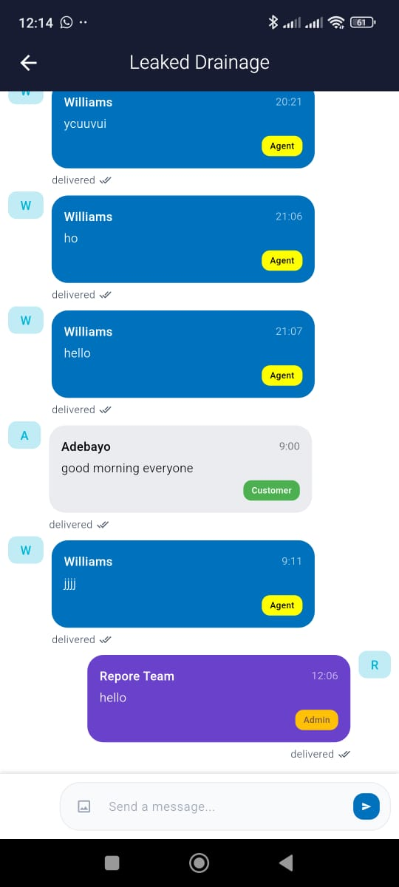

# Promptio Chat Application

Promptio is a real-time chat application built with Flutter and Firebase. It allows users to send and receive messages, manage groups, and track message statuses dynamically.

## Features
- **Authentication**: Firebase Authentication for user sign-in and registration.
- **Real-Time Messaging**: Send and receive messages instantly using Firestore.
- **Message Status Tracking**: Messages are marked as `Sent`, `Delivered`, `Read`, or `Resend` dynamically.
- **Group Chats**: Users can create and join group chats.
- **User Roles**: Different roles such as `Admin`, `Agent`, and `Customer`.

## Tech Stack
- **Flutter**: Cross-platform mobile development framework.
- **Dart**: Programming language for Flutter.
- **Firebase**:
  - Firestore (Database)
  - Firebase Authentication (User Auth)


## Setup and Installation
1. **Clone the repository**
   ```sh
   git clone https://github.com/sparklinglily/promptio.git
   cd promptio
   ```
2. **Install dependencies**
   ```sh
   flutter pub get
   ```
3. **Configure Firebase**
   - Create a Firebase project.
   - Add the `google-services.json` (for Android) and `GoogleService-Info.plist` (for iOS) in the appropriate directories.
   - Enable Firestore, Authentication, and Storage.
4. **Run the project**
   ```sh
   flutter run
   ```

## 📱 App Preview




